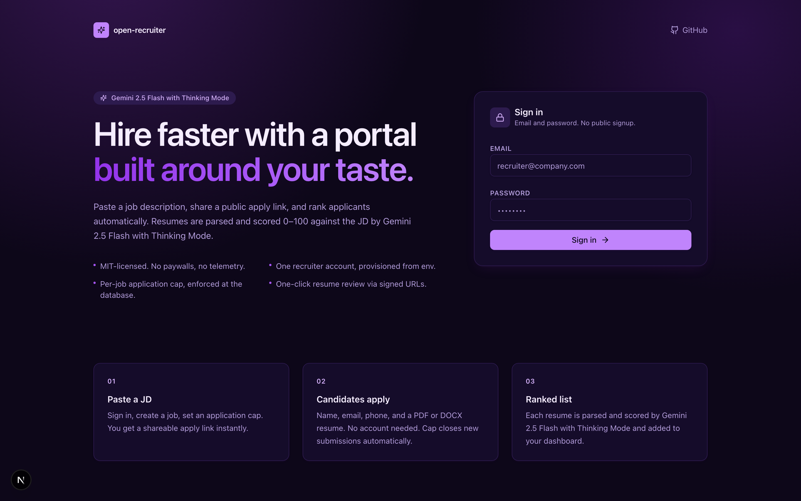
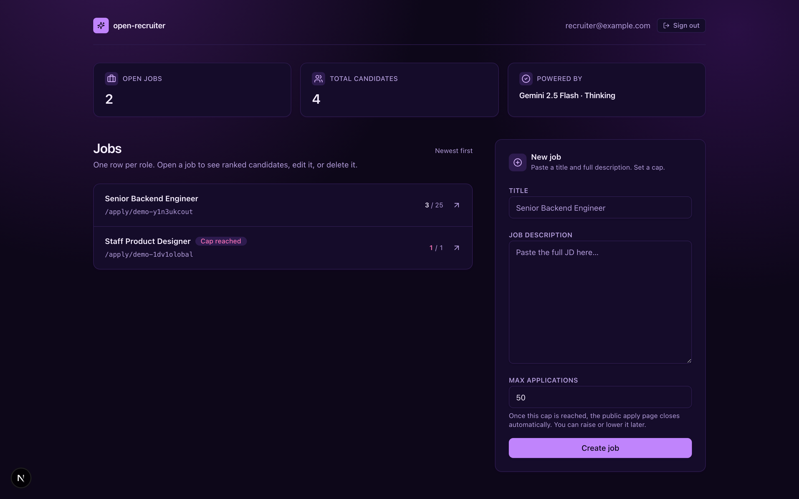
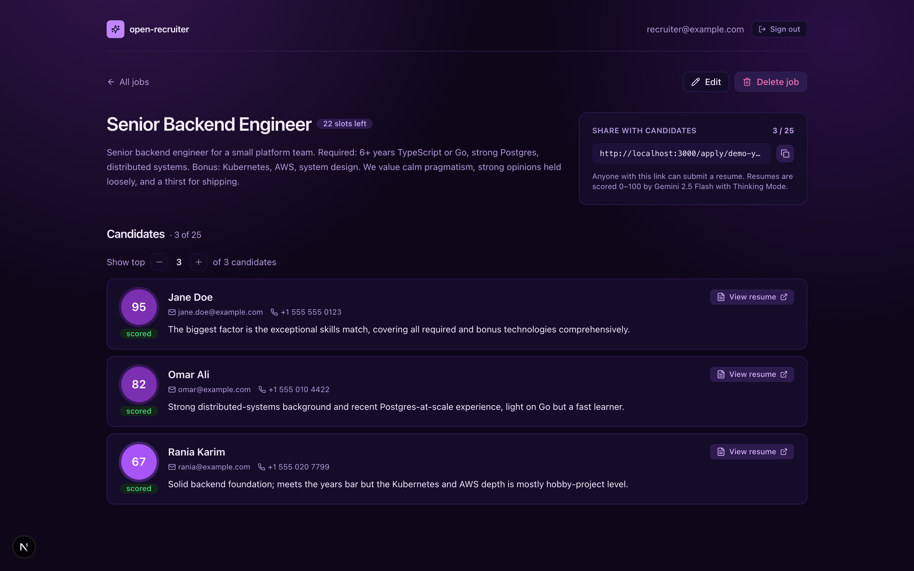
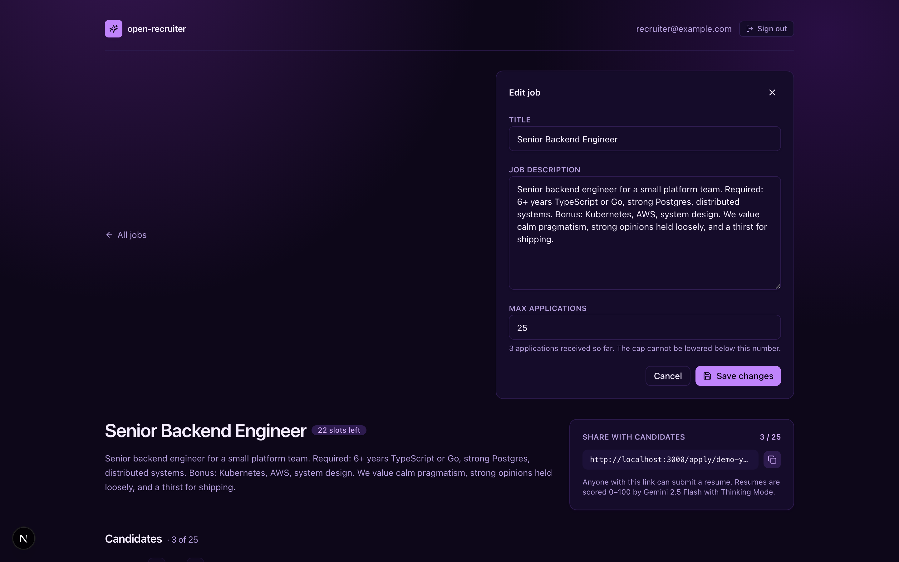
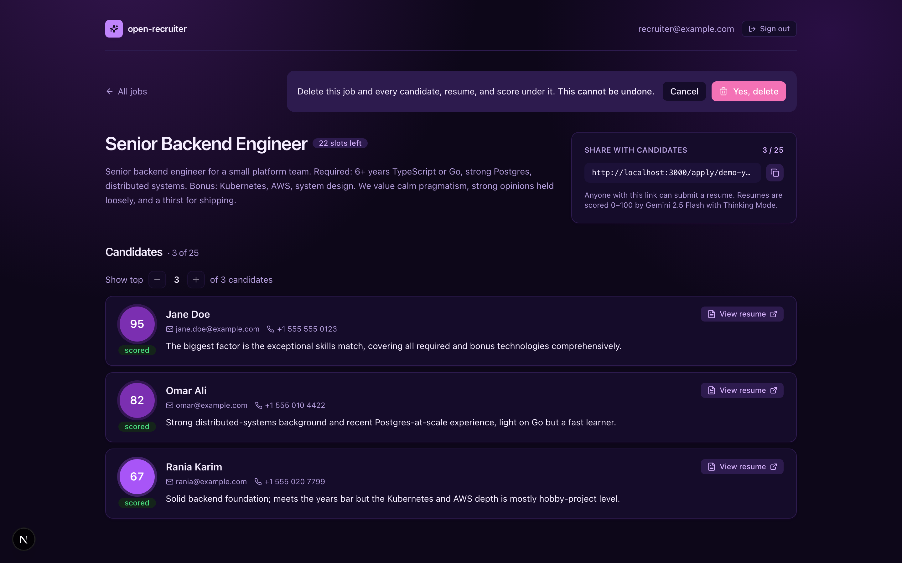
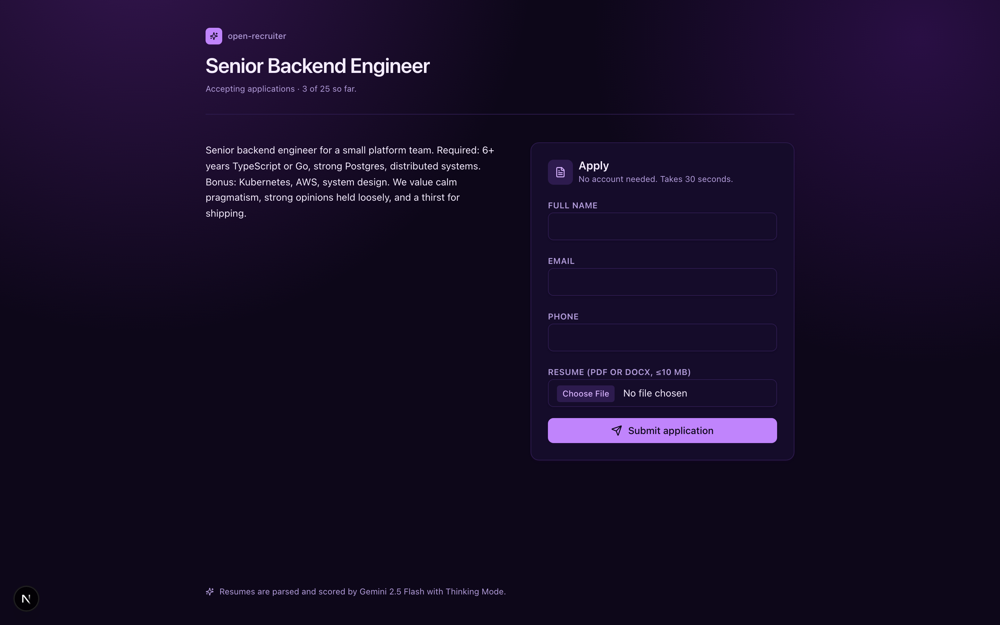
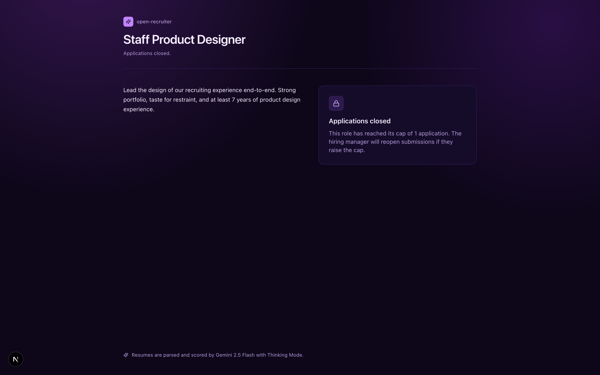
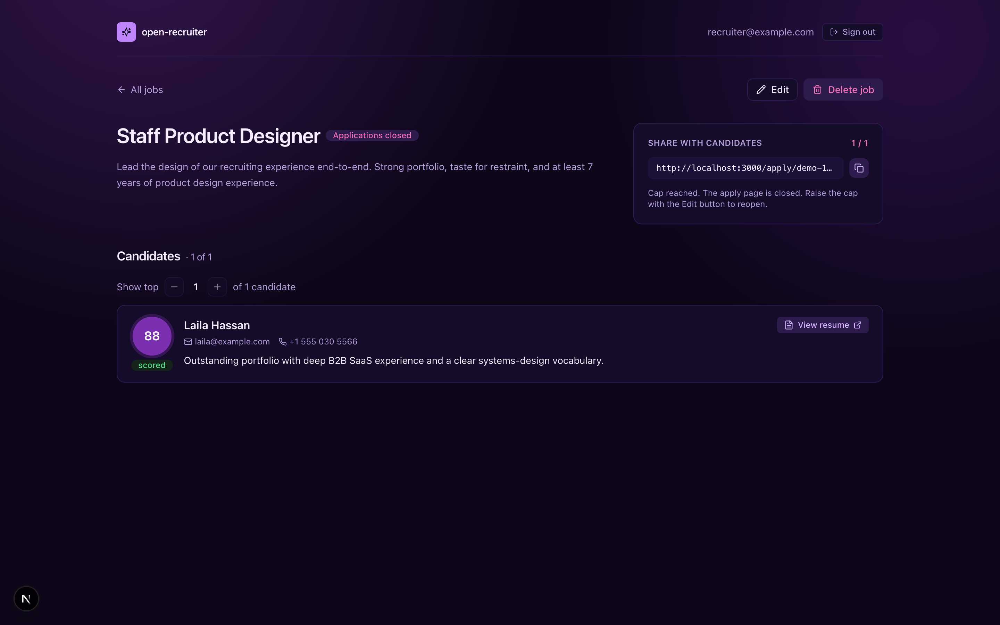

# open-recruiter

> A free, MIT-licensed, self-hostable recruiter portal. Paste a job description, share a public apply link, get a ranked list of candidates — scored 0–100 by **Gemini 2.5 Flash with Thinking Mode**.

<p align="center">
  <a href="https://***">
    
  </a>
</p>

<p align="center">
  <strong>Live demo →</strong>
  <a href="https://***">***</a>
  &nbsp;·&nbsp;
  <a href="https://vercel.com/new/clone?repository-url=https%3A%2F%2Fgithub.com%2FNawa16%2Fopen-recruiter&env=GEMINI_API_KEY,NEXT_PUBLIC_SUPABASE_URL,NEXT_PUBLIC_SUPABASE_ANON_KEY,SUPABASE_SERVICE_ROLE_KEY,RECRUITER_EMAIL,RECRUITER_PASSWORD&envDescription=Gemini%20key%2C%20Supabase%20keys%2C%20and%20the%20single%20recruiter%20account&project-name=open-recruiter">
    
  </a>
</p>

---

## What is open-recruiter?

A complete, single-recruiter hiring portal you can stand up in under 10 minutes. You paste a job description, you get a shareable apply link, and every resume that comes in is parsed and scored against the JD by Gemini 2.5 Flash with Thinking Mode. The ranked list — with a one-sentence rationale per candidate and a one-click resume preview — appears on your private dashboard.

The UI uses the Saudi-inspired **Khuzama** (lavender) palette and is built for two people: the **employer** who's hiring, and the **candidate** who's applying.

## Highlights

- **Email + password auth, no public signup.** Your recruiter account is provisioned from environment variables on every server start.
- **Per-job application cap.** Set a maximum number of resumes per role; the public apply page automatically closes when the cap is hit. Enforced by a database trigger, so the cap can't be bypassed.
- **One-click resume preview.** Each candidate row has a `View resume` button backed by a 60-second Supabase signed URL.
- **Edit + delete jobs in place.** Raise the cap to reopen a closed role, or delete a job — its candidates, resumes (in Storage), and scores cascade.
- **Copy the apply link with one click.** Sharing is a single button press.
- **Open-source and self-hosted.** No paywalls, no telemetry, no plugin lock-in. Bring your own Supabase project and Gemini API key — both have generous free tiers.

## User stories

### 👔 As the employer (recruiter)

> **I want to hire one Senior Backend Engineer this week.** I sign in, paste the job description, set the cap to 25, and copy the apply link. I drop it into LinkedIn and our company Slack. As resumes arrive, my dashboard fills with a ranked list: each row shows the candidate's score, a one-sentence rationale that names the biggest factor, and a button that opens their actual resume. I sort by score, click `View resume` on the top three, and reach out to them — all from one dashboard.

| Job | What the recruiter sees |
|---|---|
| Sign in | Email + password. No magic-link round-trip, no public signup that a stranger could exploit. |
| Create a job | Paste a title and full JD. Set a max-applications cap. Hit `Create job` — apply URL is yours instantly. |
| Share the link | `Copy apply link` icon next to the URL. One click, done. |
| Watch resumes arrive | Three stat cards at the top: open jobs, total candidates, "Powered by Gemini 2.5 Flash · Thinking". Each job row shows `N / cap`. |
| Review candidates | Ranked list per job. Score chip color-coded by band (≥80 deep, ≥60 mid, ≥40 wash). `View resume` button opens a signed URL. |
| Raise the cap or change the JD | Inline editor: title, description, max applications. The cap can't be lowered below candidates already collected. |
| Close a role | Delete the job. Resumes are removed from Storage in the same call; candidate rows cascade via FK. |

### 🙋 As the candidate

> **I see a great-looking job link from a friend.** I click it, read the JD, fill in my name, email, phone, attach my PDF resume, and hit submit. The page tells me my resume is being scored by Gemini 2.5 Flash with Thinking Mode and that I've been added to the ranked list. I don't have to make an account, accept cookies, or write a cover letter. If the role is already full, the page tells me so on arrival — I don't waste time filling out a form that wouldn't be accepted.

| Step | What the candidate sees |
|---|---|
| Open the link | Job title, full JD, "Accepting applications · N of cap so far." |
| Fill the form | Name, email, phone, PDF/DOCX resume (≤10 MB). No account, no sign-up. |
| Submit | Inline `Submitting…` state while the file uploads and Gemini scores. |
| Confirmation | "Application received. Your resume is being scored by Gemini 2.5 Flash with Thinking Mode and added to the hiring manager's ranked list." |
| Cap reached | If the role just filled up, a calm "Applications closed" card replaces the form — no error, no shouting. |

---

## Visual walkthrough

### Recruiter dashboard

> Stat cards (open jobs, total candidates, Gemini badge), the job list with `N / cap` indicators, and the inline `New job` form that creates a public apply link in one round-trip.



### Job detail — ranked candidates

> Title with a live `slots left` badge, a share card with absolute URL + copy button, and the ranked list. Each row has a colored score chip (95 / 82 / 67 here), contact info, the one-sentence Gemini rationale, and a `View resume` button.



### Edit a job inline

> The `Edit` button swaps the page into an inline editor for title, description, and max applications. Lower-bound on the cap is clamped to the live candidate count.



### Delete a job — two-step confirm

> The `Delete job` button reveals a confirm strip with the destructive copy. Confirming removes the row, cascades the candidates, and best-effort-deletes their resume files from Supabase Storage.



### Candidate apply page — open

> Clean, single-column form. No account required. Same dark-mode Khuzama theme as the recruiter side.



### Candidate apply page — closed

> When the cap is reached, the form is replaced with a closed-state card. No empty fields, no confusion.



### Recruiter's view of a closed role

> The recruiter sees the same closed status with prompt-to-raise-cap guidance.



---

## Quickstart

### Prerequisites

| | |
|---|---|
| **Node.js** | 20 or newer |
| **pnpm** | `corepack enable pnpm` |
| **Supabase** | Free account at [supabase.com](https://supabase.com) |
| **Gemini API key** | Free key at [aistudio.google.com/apikey](https://aistudio.google.com/apikey) |

### Six steps to your own copy

```bash
# 1. Clone and install
git clone https://github.com/Nawa16/open-recruiter.git
cd open-recruiter
pnpm install

# 2. Fill in your environment variables
cp .env.example .env.local
# Edit .env.local with the keys from your Supabase project and Gemini AI Studio

# 3. Apply the database schema to your Supabase project
pnpm dlx supabase login
pnpm dlx supabase link --project-ref <your-project-ref>
pnpm dlx supabase db push

# 4. Set the Gemini key as a Supabase function secret + deploy the scorer
pnpm dlx supabase secrets set GEMINI_API_KEY=$(grep GEMINI_API_KEY .env.local | cut -d= -f2)
pnpm dlx supabase functions deploy score-candidate

# 5. (Recommended) Disable email signup in your Supabase auth settings
# Dashboard → Authentication → Providers → Email → toggle off "Enable Sign ups"

# 6. Run the dev server
pnpm dev
```

Open `http://localhost:3000`. The Next.js instrumentation hook will have already provisioned your recruiter account using `RECRUITER_EMAIL` and `RECRUITER_PASSWORD`. Sign in and create your first job.

### Environment variables

Every key in `.env.example` is required.

| Name                              | Where it's used        | Notes |
|-----------------------------------|------------------------|-------|
| `GEMINI_API_KEY`                  | Supabase edge function | Gemini 2.5 Flash with Thinking Mode (parsing + scoring). |
| `NEXT_PUBLIC_SUPABASE_URL`        | Browser + Next.js server | Your Supabase project URL. |
| `NEXT_PUBLIC_SUPABASE_ANON_KEY`   | Browser + Next.js server | Anon key — safe to expose. |
| `SUPABASE_SERVICE_ROLE_KEY`       | Next.js server only     | Used by the instrumentation hook to provision the recruiter account. |
| `RECRUITER_EMAIL`                 | Instrumentation hook    | The single account that can sign in. No public signup. |
| `RECRUITER_PASSWORD`              | Instrumentation hook    | Reset on every server start, so rotating the password is just an env change. |

### Deploy to Vercel

Push to GitHub, then click the **Deploy with Vercel** button at the top of this README — it'll prompt for the same six environment variables. The Supabase Edge Function (`score-candidate`) runs on Supabase's infrastructure regardless of where Next.js is hosted.

---

## How scoring works

Each submitted resume goes through `supabase/functions/score-candidate`, a single Deno edge function that calls Gemini 2.5 Flash with Thinking Mode twice:

1. **Parse.** PDF or DOCX bytes are passed as multimodal input. The model returns structured JSON: name, email, phone, total years of experience, skills, companies (with title and years), education.
2. **Score.** The parsed JSON plus the job description are scored on a 5-axis rubric — skills match, years of experience, seniority level, domain fit, education — and the model returns `{ score: 0-100, rationale: "one sentence" }`.

Both calls use dynamic Thinking Mode (`thinkingBudget: -1`). Disabling Thinking Mode is rejected at the helper level.

## Architecture at a glance

```
Next.js 15 (App Router) ── server components, server actions, Tailwind 4
   │
   ├── Supabase Postgres ── jobs, candidates, RLS by recruiter
   ├── Supabase Storage ── private `resumes` bucket, recruiter-only signed URLs
   ├── Supabase Auth ── email+password, single recruiter account
   └── Supabase Edge Function `score-candidate`
          └── Gemini 2.5 Flash with Thinking Mode (parse + score)
```

A `BEFORE INSERT` trigger on `candidates` enforces the per-job application cap server-side, so the cap holds even under racing concurrent submissions. The candidate apply page generates the candidate UUID client-side to avoid round-tripping through RLS-restricted RETURNING clauses.

## Scripts

```bash
pnpm dev          # Next.js dev server (runs instrumentation on boot)
pnpm build        # production build
pnpm typecheck    # tsc --noEmit
pnpm lint         # eslint
pnpm test         # vitest unit tests
pnpm test:e2e     # Playwright end-to-end (requires real keys + deployed edge function)
```

## Troubleshooting

- **Sign-in fails right after deploy.** The instrumentation hook only runs on Node-runtime server start. After changing `RECRUITER_PASSWORD`, redeploy (Vercel) or restart `pnpm dev` so the hook re-runs and resets the password.
- **Gemini returns quota / 403.** Free-tier keys are rate-limited. Wait a minute. Make sure `GEMINI_API_KEY` is set both in `.env.local` (so the instrumentation hook can read it during deploy) and as a Supabase function secret (so the live edge function has it).
- **`score-candidate` times out.** Large resumes plus dynamic Thinking Mode can exceed the default 60-second function timeout. Trim the resume to the first page or bump the function timeout in `supabase/config.toml` to 120 s.
- **Anyone can still sign up via the anon key.** Open your Supabase project's `Authentication → Providers → Email` and **disable Sign ups**. The UI removes the surface, but the anon key would otherwise still accept `auth.signUp()` calls.

## License

[MIT](LICENSE) — fork it, modify it, run it inside your company. Just keep the notice.

## Contributing

Issues and pull requests are welcome. Please keep contributions focused — this project deliberately has no plugin system, no paywall, and no telemetry. Run `pnpm typecheck && pnpm lint && pnpm test` before opening a PR.
